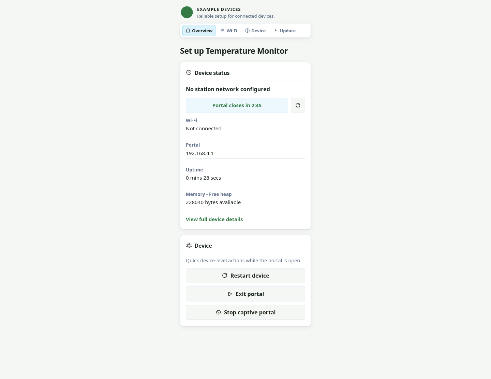
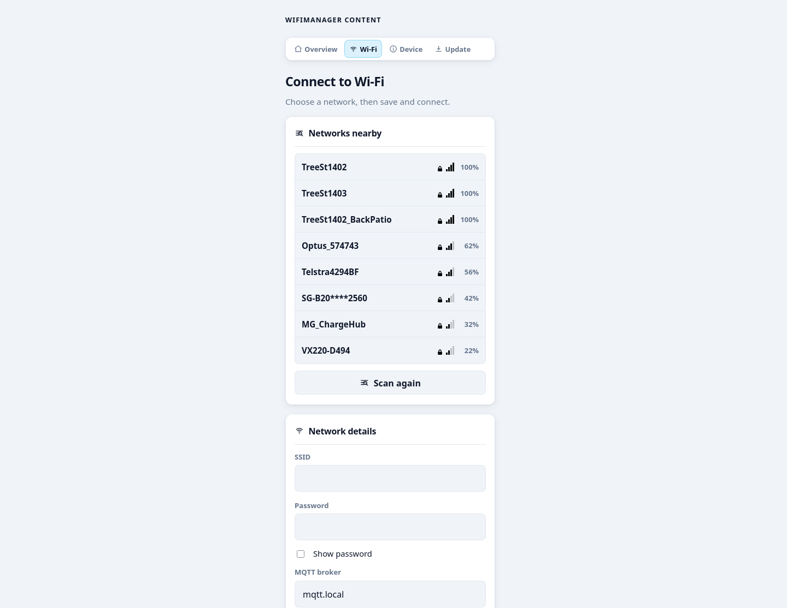

# WiFiManager

WiFiManager gives ESP8266 and ESP32 firmware a polished, self-hosted Wi-Fi setup experience. It reconnects to saved networks and opens a temporary captive portal when it cannot, so users can configure the device from any phone or browser without a cloud service or companion app.

## See it on real hardware

| Brand the built-in portal | Combine Wi-Fi and application setup |
| --- | --- |
|  |  |
| Give each product its own title, identity, icon, and color theme without copying portal HTML. | Show live nearby networks and collect application values, such as an MQTT broker, in the same setup flow. |

## Start with a working portal

```cpp
#include <Arduino.h>
#include <WiFiManager.h>

WiFiManager wifi;

void setup() {
    Serial.begin(115200);
    wifi.setConfigPortalTimeout(180);
    wifi.autoConnect("Device Setup", "change-me");
}

void loop() {
    wifi.process();
}
```

When saved Wi-Fi is unavailable, `autoConnect()` starts the portal asynchronously. Call `process()` from every `loop()` iteration while it may be open. Flash [Basic Portal](examples/BasicPortal/) to try this exact flow; its README gives the network name, password, portal address, and expected result after saving Wi-Fi.

## Make it yours

```cpp
const char kTitle[] PROGMEM = "Set up Temperature Monitor";
const char kBrand[] PROGMEM = "Example Devices";
const char kAccent[] PROGMEM = "#347a45";

void setup() {
    WiFiManagerPortalConfig portalUI;

    // Leave fields unset to keep WiFiManager's built-in portal values.
    portalUI.title = WiFiManagerPortalText::progmem(kTitle);
    portalUI.identityText = WiFiManagerPortalText::progmem(kBrand);

    // Theme values customise the built-in styles; they do not replace the portal.
    portalUI.theme.accent = WiFiManagerPortalText::progmem(kAccent);
    portalUI.theme.cornerRadiusPx = 10;

    wifi.setPortalConfig(portalUI);  // Apply before the portal starts.
    wifi.autoConnect("Device Setup");
}

void loop() {
    wifi.process();
}
```

The [Branded Portal](examples/BrandedPortal/) example includes a static SVG, accessible identity text, and a small semantic theme. [Custom Portal Content](examples/CustomPortalContent/) shows the supported parameters, information sections, and home cards without replacing the portal shell.

## What it provides

- **Captive Wi-Fi setup:** starts an access point only when saved network credentials cannot connect.
- **Responsive portal:** one small portal for Wi-Fi, application fields, information, actions, and firmware update flow.
- **Structured APIs:** C++ configuration and a local JSON protocol for the built-in portal.
- **Product presentation:** title, logo, tagline, and semantic colour tokens without copying the portal HTML.
- **Primary and fallback networks:** an opt-in two-network controller backed by an application-provided store.
- **ESP8266 and ESP32 support:** the package resolves its asynchronous web dependencies for the selected target.

## Choose a guide

| Goal | Guide |
| --- | --- |
| Understand library/application ownership and supported boundaries | [Architecture](docs/ARCHITECTURE.md) |
| Get a device online or recover from missing Wi-Fi | [Provisioning lifecycle](docs/PROVISIONING_LIFECYCLE.md) |
| Brand or constrain the built-in portal | [Portal UI and configuration](docs/PORTAL_UI.md) |
| Add and persist application settings, status, or home cards | [Portal content](docs/PORTAL_CONTENT.md) |
| Configure primary/fallback station profiles | [Station profiles](docs/STATION_PROFILES.md) |
| Surface setup, offline, and connection state in firmware | [Observability](docs/OBSERVABILITY.md) |
| Configure AP, station, scan, or reconnect behaviour | [Network configuration](docs/NETWORK_CONFIGURATION.md) |
| Look up a supported C++ method and its timing | [API reference](docs/API_REFERENCE.md) |
| Understand the built-in portal's local JSON protocol | [Portal API](docs/PORTAL_API.md) |
| Follow deployment-oriented integration patterns | [Recipes](docs/recipes/README.md) |
| Build or flash a complete example | [Examples](examples/README.md) |
| Run documentation and board-free compile checks | [Testing](docs/TESTING.md) |
| Contribute to this fork or prepare a release | [Development](docs/DEVELOPMENT.md) |

## Install

```ini
[common]
lib_deps =
    WiFiManager=https://github.com/alexhopeoconnor/WiFiManager.git#v3.2.3
```

The suffix after `#` is a Git ref. PlatformIO clones the repository and checks out that release tag; GitHub Release assets are unrelated. Arduino IDE users can install this repository as a library checkout.

See the [documentation index](docs/README.md), [examples](examples/README.md), [release history](CHANGELOG.md), and [licence](LICENSE).
