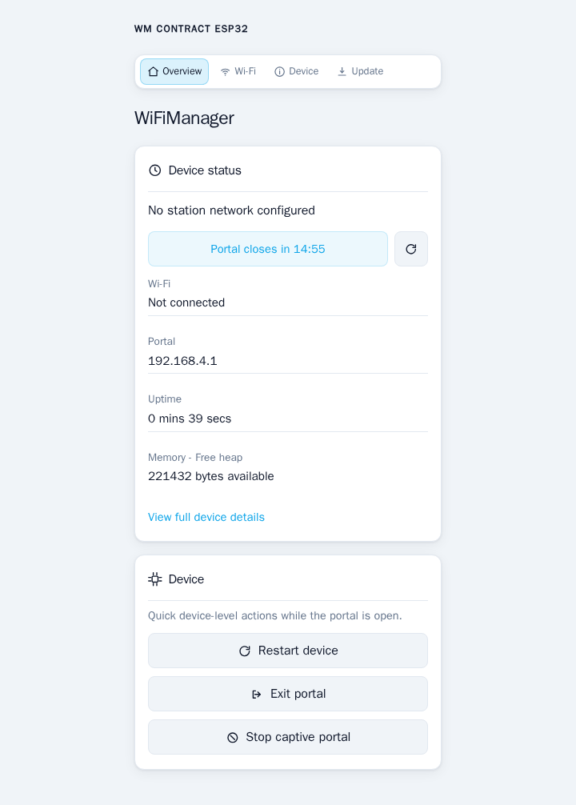
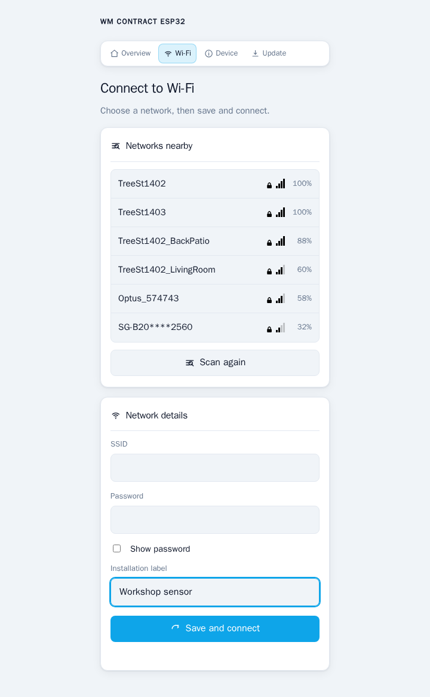

# Portal UI and configuration

WiFiManagerPortalConfig is the supported presentation API for the built-in provisioning portal. It changes product identity and semantic visual tokens; the portal-policy methods below control the visibility and behavior of existing built-in features. WiFiManager continues to own portal routes, forms, navigation, captive behavior, reset, and OTA views.

Apply presentation before autoConnect(), startConfigPortal(), or startWebPortal(). Configure portal policy during boot as well so each portal session begins consistently. Portal text and SVG assets are non-owning, so their RAM or PROGMEM data must have static firmware lifetime. WiFiManager locks presentation while a portal is active so asynchronous responses cannot observe partial configuration; setPortalConfig() returns false if it cannot accept the configuration.

## Portal views

These ESP32 captures use the same real-board portal test harness described in
[Testing](TESTING.md). The nearby networks shown are the networks visible to
the capture device when the portal scans.

| Overview | Wi-Fi and application settings |
| --- | --- |
|  |  |

## Standalone branded portal

~~~cpp
#include <Arduino.h>
#include <WiFiManager.h>

WiFiManager wifi;

namespace {
const char kTitle[] PROGMEM = "Set up Temperature Monitor";
const char kIdentity[] PROGMEM = "Example Devices";
const char kTagline[] PROGMEM = "Reliable setup for connected devices.";
const char kLogoAlt[] PROGMEM = "Example Devices";
const char kLogo[] PROGMEM =
    R"svg(<svg viewBox="0 0 64 64"><circle cx="32" cy="32" r="28"/></svg>)svg";
const char kPage[] PROGMEM = "#f4f7f3";
const char kSurface[] PROGMEM = "#ffffff";
const char kAccent[] PROGMEM = "#347a45";
const char kAccentText[] PROGMEM = "#ffffff";

WiFiManagerPortalConfig kPortalUI;
}

void setup() {
    // Set only the identity values this product needs.
    kPortalUI.title = WiFiManagerPortalText::progmem(kTitle);
    kPortalUI.identityText = WiFiManagerPortalText::progmem(kIdentity);
    kPortalUI.tagline = WiFiManagerPortalText::progmem(kTagline);
    kPortalUI.logo = WiFiManagerPortalAsset::svgFromProgmem(kLogo);
    kPortalUI.logoAltText = WiFiManagerPortalText::progmem(kLogoAlt);

    // Unset theme values retain the built-in style.
    kPortalUI.theme.pageBackground = WiFiManagerPortalText::progmem(kPage);
    kPortalUI.theme.surface = WiFiManagerPortalText::progmem(kSurface);
    kPortalUI.theme.accent = WiFiManagerPortalText::progmem(kAccent);
    kPortalUI.theme.accentText = WiFiManagerPortalText::progmem(kAccentText);
    kPortalUI.theme.cornerRadiusPx = 10;

    if (!wifi.setPortalConfig(kPortalUI)) {
        Serial.println("Portal UI configuration was rejected");
    }
    wifi.autoConnect("Temperature Monitor");
}

void loop() { wifi.process(); }
~~~

The complete buildable example is [Branded Portal](../examples/BrandedPortal/BrandedPortal.ino). The compile fixture exercises this API on ESP8266 and the maintained ESP32 3.3.11 baseline.

## Presentation reference

Leave a text or colour value empty, or a radius at 0, to retain the built-in stylesheet value.

| Field | Used by |
| --- | --- |
| title | Document title and concise setup-page heading |
| identityText | Company or product name in the header above navigation |
| tagline | Short product context in the header above navigation |
| logo.svg, logoAltText | Optional trusted inline SVG and its accessible label |
| pageBackground, surface, text, mutedText, border | Portal surfaces and text |
| accent, accentHover, accentText | Primary links and actions |
| success, danger, dangerHover | Status and destructive actions |
| cornerRadiusPx, smallCornerRadiusPx | Card and compact-control corners, limited to 64 px |

Theme values accept simple named CSS values and are emitted once into a small
portal theme block. Raw CSS and JavaScript are not supported. An SVG is a
trusted compiled firmware asset, never form, MQTT, or network input.

## Portal policy

Use the portal-prefixed methods to choose which built-in pages and actions a
product presents. Configure them during boot, before the portal starts, so a
session begins with the intended behavior.

~~~cpp
// An installer portal that does not expose destructive reset or OTA actions.
wifi.portalSetPageUpdateVisible(false);
wifi.portalSetActionEraseVisible(false);
wifi.portalSetActionRestartVisible(false);

// Keep application settings on their own Setup page.
wifi.portalSetLayoutParamsLocation(PortalParamsLocation::SetupPage);

// Do not show saved passwords or static-IP fields unless the product needs them.
wifi.portalSetFieldPasswordPlaceholderMode(PortalPasswordPlaceholderMode::Hidden);
wifi.portalSetFieldStaticIpVisibility(PortalFieldVisibility::Hidden);
wifi.portalSetFieldStaticDnsVisibility(PortalFieldVisibility::Hidden);
~~~

| Group | Methods | Use |
| --- | --- | --- |
| Pages | portalSetPageInfoVisible(), portalSetPageUpdateVisible(), portalSetPageSetupVisible() | Show only product-appropriate built-in pages. |
| Actions | portalSetActionEraseVisible(), portalSetActionRestartVisible(), portalSetActionExitVisible(), portalSetActionCloseCaptiveVisible(), portalSetActionBackVisible() | Control existing action affordances; hiding an action is not a security boundary. |
| Layout | portalSetLayoutParamsLocation() | Put registered parameters on the Wi-Fi page or separate Setup page. |
| Connection/portal behavior | portalSetBehaviorCaptivePortalEnabled(), portalSetBehaviorConnectOnSave(), portalSetBehaviorExitAllowed(), portalSetBehaviorConnectTimeoutSeconds(), portalSetBehaviorPortalTimeoutSeconds(), portalSetBehaviorAutoReconnect(), portalSetBehaviorApClientCheck(), portalSetBehaviorWebClientCheck() | Set built-in portal behavior. |
| Fields | portalSetFieldPasswordPlaceholderMode(), portalSetFieldStaticIpVisibility(), portalSetFieldStaticDnsVisibility() | Limit password disclosure and network-field visibility. |

The older setConfigPortalTimeout(), setSaveConnect(), setShowStaticFields(), and related methods remain available. Prefer a single vocabulary within a product; the portal-prefixed methods make the policy visible in the portal's structured model.

## Structured content

Use portalAddParameter() for editable product settings, portalAddInfoSection() for labelled read-only values, and portalAddHomeCard() for overview text or key/value cards. Parameters remain application-owned; information sections and cards are copied when registered.

See [Portal content](PORTAL_CONTENT.md) for the full persistence, validation, callback, and lifetime rules. The buildable [Custom Portal Content](../examples/CustomPortalContent/) example shows all three content types.

## What stays built in

Branding, policy, and structured content configure the supplied portal. The
portal's HTML shell, routes, navigation, stylesheet, and scripts stay owned by
WiFiManager. There is no custom shell, route replacement, navigation injection,
raw stylesheet, or script hook.

For a product-specific web application, start that application's own server
after WiFiManager has completed provisioning. If the supplied portal needs a
reusable capability, add one focused public WiFiManager C++ API and test it on
ESP8266 and ESP32.

Back to the [documentation index](README.md) or [project overview](../README.md).
